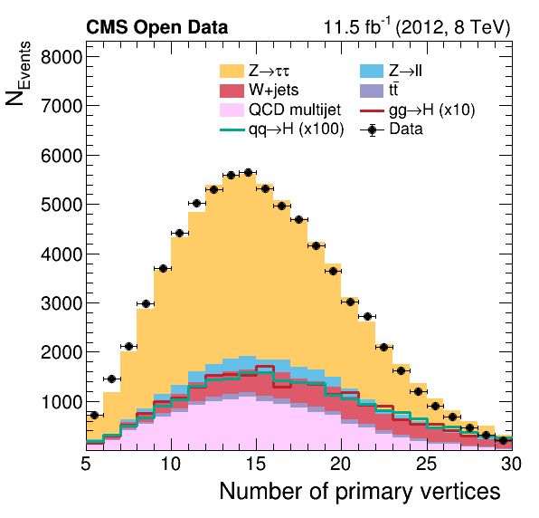
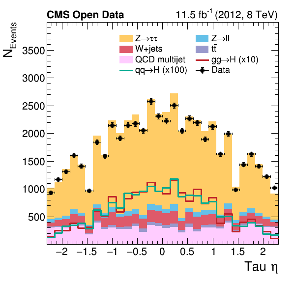
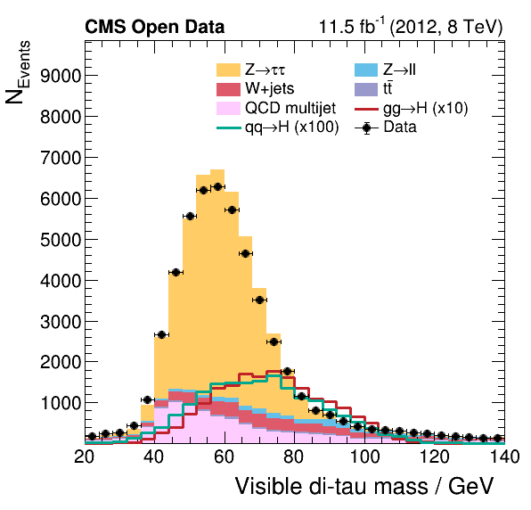

# Analysis of Higgs boson decays to two tau leptons using data and simulation from the CMS detector

This repository contains an analysis using reduced NanoAOD files created from CMS open data studying the decay of a Higgs boson into two tau leptons. The code produces plots such as shown below which can be used to study the physics in the CMS datasets.

# How to run this?

TODO
